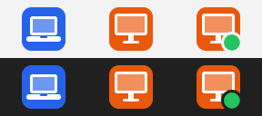
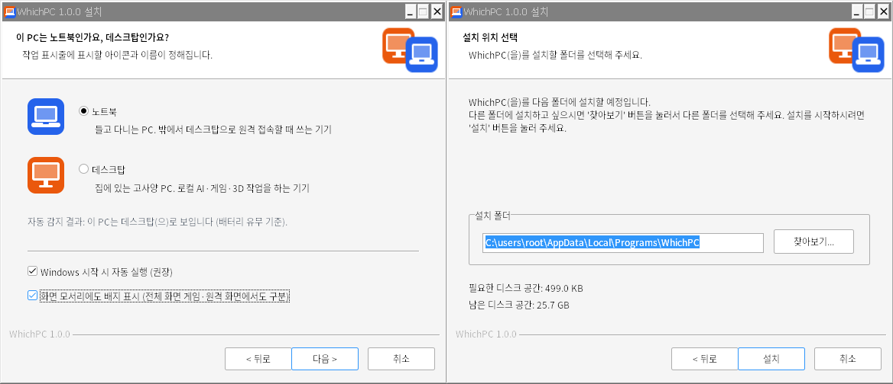
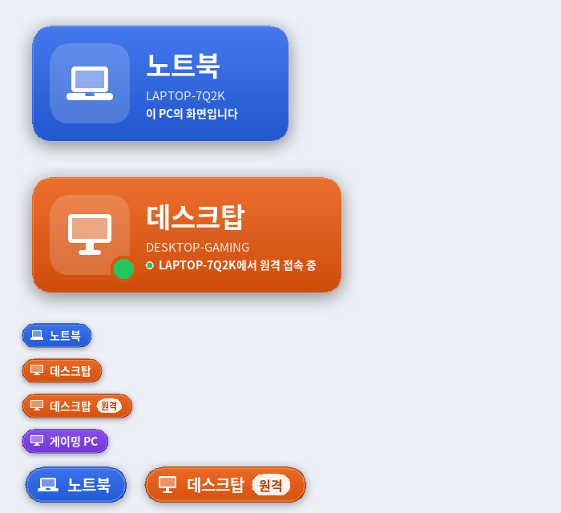
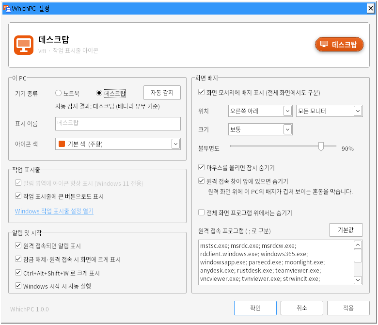

# WhichPC — 지금 보는 화면이 노트북인가, 데스크탑인가

노트북에서 데스크탑으로 원격 접속해서 쓰다 보면, 지금 만지고 있는 화면이 **노트북인지 데스크탑인지** 헷갈릴 때가 있습니다.
WhichPC는 작업 표시줄에 **노트북 아이콘** 또는 **데스크탑 아이콘**을 띄워서 이걸 바로 알려 주는 작은 Windows 프로그램입니다.



왼쪽부터 **노트북**(파랑), **데스크탑**(주황), **원격 접속 중인 데스크탑**(초록 점). 위는 밝은 작업 표시줄, 아래는 어두운 작업 표시줄입니다.

## 원리

같은 설치 파일을 **노트북과 데스크탑에 각각** 설치하고, 설치할 때 그 PC의 종류만 다르게 고르면 됩니다.

- 노트북의 작업 표시줄에는 🟦 노트북 아이콘이 뜹니다.
- 데스크탑의 작업 표시줄에는 🟧 데스크탑 아이콘이 뜹니다.
- 노트북에서 데스크탑으로 원격 접속하면 **원격 화면 안의 작업 표시줄은 데스크탑의 것**이므로 🟧 데스크탑 아이콘이 보입니다.
  창 모드로 접속하면 바깥(노트북) 작업 표시줄에는 🟦, 원격 창 안에는 🟧 이 보여서 둘을 바로 구분할 수 있습니다.

## 다운로드 · 설치

1. [`dist/WhichPC-Setup-1.0.0.exe`](dist/WhichPC-Setup-1.0.0.exe)를 받습니다 (약 380 KB).
2. 노트북에서 실행하고 **노트북**을 고릅니다. 데스크탑에서도 실행하고 **데스크탑**을 고릅니다.
   PC 종류는 자동으로 감지해서 미리 선택해 둡니다 (SMBIOS 섀시 정보, 없으면 배터리 유무로 판단).
3. 끝입니다. 알림 영역(시계 옆)에 아이콘이 생기고, Windows를 켤 때마다 자동으로 실행됩니다.



- **관리자 권한이 필요 없습니다.** 현재 사용자 계정에만 설치됩니다 (`%LOCALAPPDATA%\Programs\WhichPC`).
- Windows 10 / 11 (64비트) 용입니다.
- 설치 파일에 디지털 서명이 없어서, 처음 실행할 때 **"Windows의 PC 보호"** 창이 뜰 수 있습니다.
  **추가 정보 → 실행**을 누르면 설치됩니다.
- 네트워크 통신은 전혀 하지 않습니다. 설정은 레지스트리 `HKCU\Software\WhichPC`에만 저장됩니다.

## 사용법

| 동작 | 결과 |
|---|---|
| 아이콘 **클릭** | 화면 가운데에 "데스크탑 · 컴퓨터 이름 · 상태" 카드가 1.5초간 크게 표시됩니다 |
| **Ctrl + Alt + Shift + W** | 위와 같음. 원격 화면에 키보드가 가 있으면 원격 PC(데스크탑)가 응답하므로, 지금 입력이 어느 PC로 가는지도 확인됩니다 |
| 아이콘 **우클릭** | 메뉴: 화면 배지 켜기/위치, 큰 작업 표시줄 버튼, PC 종류 변경, 설정, 자동 실행, 종료 |
| 아이콘 **더블클릭** | 설정 창 |
| 시작 메뉴의 **WhichPC** | 꺼져 있으면 실행, 이미 실행 중이면 설정 창 |



### 주요 기능

- **작업 표시줄 아이콘** — 16 px부터 256 px까지 크기마다 따로 그린 아이콘이라 어떤 배율(100 %~400 %)에서도 선명합니다.
  밝은/어두운 작업 표시줄 모두에서 잘 보이도록 색 타일 위에 흰 그림을 올린 형태입니다.
- **Windows 11 숨김 방지** — Windows 11은 새 아이콘을 `^` 안으로 숨기는데, WhichPC는 자기 아이콘을 자동으로 "항상 표시"로 바꿉니다
  (설정에서 끌 수 있음). Windows 10에서는 `^`를 눌러 아이콘을 작업 표시줄로 끌어다 놓으세요.
- **원격 접속 표시** — 데스크탑에 원격 데스크톱(RDP)으로 접속하면 아이콘에 **초록 점**이 붙고,
  "LAPTOP-XXX에서 이 데스크탑에 원격으로 연결했습니다" 알림과 함께 화면 가운데 카드가 뜹니다.
- **화면 모서리 배지** (선택) — 전체 화면 게임·3D 프로그램처럼 작업 표시줄이 안 보일 때를 위해, 화면 모서리에 작은 배지를 띄웁니다.
  - 클릭이 통과되고(아래 창을 그대로 클릭 가능), 마우스를 올리면 잠시 사라집니다.
  - 위치 6곳(모서리·가운데), 크기 3단계, 불투명도, 모든 모니터/주 모니터만 선택.
  - **원격 접속 창이 앞에 있으면 자동으로 숨김**: 노트북에서 원격 창(mstsc, Parsec, Moonlight, AnyDesk, RustDesk, TeamViewer, Chrome 원격 데스크톱 등)을
    보고 있을 때 노트북의 "노트북" 배지가 원격 화면 위에 겹쳐 보이는 혼동을 막습니다. 원격 창이 배지를 가리는 위치에 있을 때만 숨깁니다.
    목록에 없는 원격 프로그램은 설정에서 실행 파일 이름을 추가하면 됩니다.
  - 전체 화면 프로그램 위에서는 숨기기 (선택).
- **큰 작업 표시줄 버튼** (선택) — 알림 영역 대신 작업 표시줄 가운데에 앱처럼 큰 아이콘 버튼을 둡니다. 눌러도 창이 열리지 않고 카드만 표시됩니다.
- **이름·색 바꾸기** — "게이밍 PC"처럼 이름을 바꾸거나 9가지 색/사용자 지정 색을 고를 수 있습니다.
- 잠금 해제·원격 접속 시 자동으로 카드 표시, 탐색기가 재시작되어도 아이콘 자동 복구, 화면 배율·모니터 구성 변경 자동 대응.

### 원격 접속 도구별 동작

| 도구 | 데스크탑 쪽 표시 |
|---|---|
| Windows 원격 데스크톱 (mstsc / Windows App) | 🟧 아이콘 + **초록 점**, 접속 알림, 카드 표시, 배지에 "원격" 표시 |
| Parsec · Moonlight/Sunshine · AnyDesk · RustDesk · TeamViewer 등 화면 스트리밍 | 데스크탑의 실제 화면이 전송되므로 🟧 아이콘과 배지가 그대로 보입니다 (스트리밍은 Windows가 원격 세션으로 인식하지 않아 초록 점은 붙지 않습니다) |

### 설정 창



## 무인 설치 (선택)

```
WhichPC-Setup-1.0.0.exe /S /TYPE=desktop          조용히 설치, 종류 지정 (laptop | desktop)
WhichPC-Setup-1.0.0.exe /S /TYPE=laptop /OVERLAY=1   화면 배지도 켬
WhichPC-Setup-1.0.0.exe /NOAUTOSTART               자동 실행 끔
```

프로그램 명령줄: `WhichPC.exe --settings` · `--flash` · `--quit` · `--type=laptop|desktop` · `--detect`(설치 프로그램용, 종료 코드 = 1 + 종류 + 10 × 근거)

## 제거

**설정 → 앱 → 설치된 앱 → WhichPC → 제거**. 제거할 때 설정(PC 종류, 색 등)도 지울지 물어봅니다.

## 문제 해결

- **아이콘이 안 보여요** → 작업 표시줄의 `^`를 눌러 보세요. Windows 11은 설정의 "알림 영역에 아이콘 항상 표시"가 켜져 있는지 확인하세요.
  (설정 창의 "Windows 작업 표시줄 설정 열기"에서 직접 켤 수도 있습니다.)
- **원격 창 위에 노트북 배지가 겹쳐 보여요** → 설정 → 화면 배지 → 원격 접속 프로그램 목록에 그 프로그램의 실행 파일 이름(작업 관리자 → 세부 정보에서 확인)을 추가하세요.
- **PC 종류를 잘못 골랐어요** → 아이콘 우클릭 → 이 PC 종류 → 노트북/데스크탑.

## 직접 빌드하기

Linux(또는 WSL)에서 교차 컴파일합니다. 필요한 것: `python3` + Pillow, `mingw-w64`, `nsis`.

```
sudo apt install mingw-w64 nsis python3-pil
./build.sh            # → build/WhichPC.exe, dist/WhichPC-Setup-1.0.0.exe
```

GitHub Actions(`.github/workflows/whichpc.yml`)가 푸시할 때마다 같은 방식으로 빌드한 뒤, Windows 러너에서 무인 설치 → 실행 → 트레이 등록 확인 → 제거까지 자동으로 검사합니다.

| 경로 | 내용 |
|---|---|
| `src/main.cpp` | 트레이 아이콘, 메뉴, 원격 세션 감지, 단축키, 작업 표시줄 버튼, 명령줄 |
| `src/overlay.cpp` | 화면 모서리 배지(숨김 규칙)와 가운데 카드 |
| `src/render.cpp` | 아이콘 합성, GDI+로 그리는 배지·카드(블러 그림자) |
| `src/settings.cpp` | 설정 저장(레지스트리)과 설정 창 |
| `src/system.cpp` | 노트북/데스크탑 자동 감지, RDP 세션 정보, Windows 11 트레이 승격 |
| `tools/gen_assets.py` | 크기별 아이콘 마스크·ICO·설치 프로그램 그림 생성 |
| `tools/render_preview.cpp` | 런타임 렌더링 결과를 PNG로 저장하는 확인용 도구 |
| `installer/WhichPC.nsi` | NSIS 설치 프로그램 (PC 종류 선택 화면 포함) |
